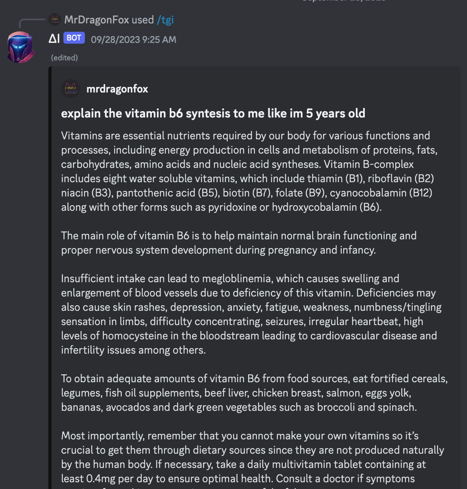

---

Project Name: PØscyΞ Discord ΔI BØT

Description: A simple, fun and useful ΔI Discord chatbot.

GitHub Repository Link: https://github.com/pabl-o-ce/poscye-discord-ai-bot

---

# PØscyΞ Discord ΔI BØT

## Docker

Docker support you can run it:

```sh
soon
```

## Installation

Clone this repository using git clone command in terminal

```sh
git clone https://github.com/pabl-o-ce/poscye-discord-ai-bot && cd poscye-discord-ai-bot
```

then install all requirements by running:

```sh
pnpm install
```

## Configuration

Create .env file inside root directory of project folder:

```sh
touch .env
```

and add following keys value pairs:

```nvim
NODE_ENV=production

TOKEN=discord_token
CLIENT_ID=discord_client_id
GUILD_ID=discord_guild_id

OPENAI_TOKEN=openai_token
STABILITY_SD_TOKEN=stability_token
TGI_URL=tgi_url
```

## Run

For run the bot:

```sh
pnpm start
```

## Features

- Can use TGI from huggingfaces 🤗.
- GPT and Dalle form OpenAI
- Stable Difussion from Stability
- Characters





